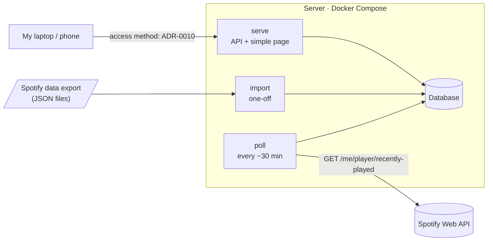

# Spotify Listening Tracker

A small, self-hosted service that records my Spotify listening history and answers one question: **what have I played most** in the last day, week, month, 6 months, year, or all time?

The app is deliberately simple. The real point of this project is to **learn DevOps by running it like a production system**: containers, CI/CD, infrastructure as code, monitoring, and tested backups. Every significant decision, and the alternatives I rejected, is recorded in [`docs/adr/`](docs/adr/).

> **Status: Phase 0 (Setup).** The sections below describe the target design. Sections marked *(planned)* aren't built yet. See the [roadmap](#roadmap) for progress.

---

## Why this exists

Spotify's API only exposes your **50 most recent plays**. Anything older disappears from the API. Spotify Wrapped shows a yearly summary, but you can't query your own history on demand.

This project fixes that by:

1. **Polling** the recently-played endpoint every ~30 minutes and saving each play before it falls out of that 50-track window.
2. **Backfilling** years of history from Spotify's downloadable Extended Streaming History export.
3. **Serving** ranked top tracks for any time range from a database.

Because plays that fall out of the window exist only in my database, the system has to run reliably without supervision. That makes it a good vehicle for learning operations.

---

## Architecture



| Component | Role |
|---|---|
| **Poller** (`poll`) | Fetches plays newer than the latest one stored and inserts them. Runs on a schedule. Safe to run any number of times. |
| **Importer** (`import`) | One-time load of historical plays from a Spotify data export. Also idempotent. |
| **API** (`serve`) | Read-only. Returns top tracks for a time range, plus a health check. |
| **Database** | The only durable state. Everything else can be rebuilt. |

All components ship as **one container image** with different subcommands.

### Design principles

- **Idempotent ingestion.** Re-running the poller or importer never changes the results. How duplicates are prevented is decided in ADR-0005.
- **Scheduled polling.** How the poller is scheduled is decided in ADR-0004.
- **Small attack surface.** The server makes only outbound requests to Spotify. How I reach the dashboard is decided in ADR-0010.
- **Configuration through environment variables**, following [The Twelve-Factor App](https://12factor.net/).

---

## Roadmap

Weekend-paced alongside a full-time course load. Each phase introduces one area of DevOps practice, and the decisions made along the way are recorded in [`docs/adr/`](docs/adr/). This timeline is hopeful and ambitious, but even if responsibilites get in the way, I hope to have all of these phases done by at most 2 weeks after the self-imposed target.

| Phase | What it adds | Target | Status |
|---|---|---|---|
| 0 | Repo, tooling, Spotify app, data export requested | Sep 2026 | 🔄 In progress |
| 1 | Poller, schema, top-tracks API, tests | Oct 2026 | ☐ |
| 2 | Docker image + Compose stack | Oct 2026 | ☐ |
| 3 | First deploy to a server (by hand, fully documented) | Nov 2026 | ☐ |
| 4 | CI: lint, test, build, scan, publish to a container registry | Nov 2026 | ☐ |
| 5 | Historical backfill from Spotify export | Nov 2026 | ☐ |
| 6 | Infrastructure as Code | Dec 2026 | ☐ |
| 7 | Continuous deployment with health-checked rollouts | Jan 2027 | ☐ |
| 8 | Metrics, dashboards, alerting, external heartbeat | Jan 2027 | ☐ |
| 9 | Offsite backups + timed restore drill | Jan 2027 | ☐ |
| 10 | *Stretch:* Kubernetes (k3s) + GitOps with Argo CD | Spring 2027 | ☐ |

---

## Getting started

### Prerequisites

- **Spotify Premium** on the account that owns the developer app. Spotify requires this for Development Mode apps as of 2026.
- [Docker Desktop](https://docs.docker.com/desktop/) (Windows: WSL2 backend) or Docker Engine on Linux
- [Git](https://git-scm.com/)
- [Go](https://go.dev/dl/) (see [ADR-0001](docs/adr/0001-language-and-framework.md); the required version is set in `go.mod` in Phase 1)

### 1. Create a Spotify developer app

1. Go to the [Spotify developer dashboard](https://developer.spotify.com/dashboard) and create an app.
2. Add this redirect URI exactly: `http://127.0.0.1:8888/callback`
   Spotify no longer accepts `localhost`; the loopback IP is required.
3. Select **Web API** as the API used.
4. Copy the **Client ID** and **Client Secret**.

### 2. Request your streaming history (optional, for backfill)

At [spotify.com/account/privacy](https://www.spotify.com/account/privacy/), request **Extended streaming history**. It can take up to 30 days to arrive. Keep the downloaded files **outside this repo** or in a gitignored folder, since they contain personal data.

### 3. Clone and configure

```powershell
# PowerShell
git clone https://github.com/rn727/spotify-tracker.git
cd spotify-tracker
Copy-Item .env.example .env
notepad .env
```

```bash
# bash
git clone https://github.com/rn727/spotify-tracker.git
cd spotify-tracker
cp .env.example .env
nano .env
```

Fill in the values described in [Configuration](#configuration). **Never commit `.env`.**

### 4. Authorize with Spotify *(planned, Phase 1)*

Runs once on your own machine. It opens a browser, you approve access, and it saves a refresh token to `.env`.

```
go run ./cmd/tracker authorize
```

### 5. Run the stack *(planned, Phase 2)*

```
docker compose up -d --build
docker compose run --rm api migrate
docker compose ps
```

Then open `http://127.0.0.1:8000`.

---

## Configuration

All settings come from environment variables, loaded from `.env` locally. `.env.example` lists every variable with placeholder values.

| Variable | Required | Description |
|---|---|---|
| `SPOTIFY_CLIENT_ID` | Yes | From the Spotify developer dashboard |
| `SPOTIFY_CLIENT_SECRET` | Yes | From the Spotify developer dashboard. **Secret.** |
| `SPOTIFY_REDIRECT_URI` | Yes | `http://127.0.0.1:8888/callback` |
| `SPOTIFY_REFRESH_TOKEN` | Yes | Written by the `authorize` step. **Secret.** |
| `SPOTIFY_AUTHORIZED_AT` | Yes | ISO date of authorization, used to warn before the refresh token expires |
| `DATABASE_URL` | Yes | Database connection string. Format depends on [ADR-0002](docs/adr/). **May contain a secret.** |
| `POLL_INTERVAL_SECONDS` | No | Seconds between polls. Default `1800` |
| `TIMEZONE` | No | Used for display, and for time ranges if ADR-0006 chooses calendar-based ranges. Default `America/Los_Angeles` |

Other database variables depend on ADR-0002. If the database needs a password, generate a strong one:

```powershell
# PowerShell
[Convert]::ToBase64String([System.Security.Cryptography.RandomNumberGenerator]::GetBytes(32))
```

```bash
# bash
openssl rand -base64 32
```

---

## Usage *(planned, Phase 1)*

### API

| Endpoint | Description |
|---|---|
| `GET /top-tracks?range=<range>&limit=<n>` | Tracks ranked by play count. `range` is one of `1d`, `1w`, `1m`, `6m`, `1y`, `all`. `limit` defaults to 10. |
| `GET /healthz` | `200` if the app can reach the database, otherwise an error status |
| `GET /metrics` | Metrics *(Phase 8, format depends on ADR-0020)* |

```powershell
# PowerShell
Invoke-RestMethod "http://127.0.0.1:8000/top-tracks?range=1w&limit=5"
```

```bash
# bash
curl "http://127.0.0.1:8000/top-tracks?range=1w&limit=5"
```

### Commands

| Command | Purpose |
|---|---|
| `authorize` | One-time Spotify OAuth. Saves a refresh token. |
| `migrate` | Applies database schema migrations |
| `poll` | Fetches new plays and inserts them |
| `import <path>` | Loads a Spotify Extended Streaming History export |
| `serve` | Starts the API |

---

## Known limitations

These come from Spotify's API rules as of September 2026 and shape the design:

- **Only the last 50 plays are available** through the API, so gaps in polling longer than ~50 songs lose data until the next export backfill.
- **What counts as a play** is decided in ADR-0014, so play counts may differ slightly from Spotify's own numbers.
- **Refresh tokens reportedly expire about six months after authorization.** You'll need to re-run `authorize` twice a year; monitoring warns before that happens.
- **Development Mode allows up to 5 users**, so this is a personal tool rather than a public service.
- **Data starts when polling starts.** Earlier history needs the export backfill.

Spotify's [February 2026 migration guide](https://developer.spotify.com/documentation/web-api/tutorials/february-2026-migration-guide) has the details.

---

## Documentation

| Document | What's in it |
|---|---|
| [`docs/adr/`](docs/adr/) | Architecture Decision Records: what was decided, what was rejected, and why |
| [`docs/runbook.md`](docs/runbook.md) | How to operate the system: deploy, roll back, restore, re-authorize |
| [`LEARNING_LOG.md`](LEARNING_LOG.md) | Weekly notes on what I learned and what broke |
| [`AGENTS.md`](AGENTS.md) | Instructions for AI coding agents working in this repo |

---

## Tech stack

| Area | Tool | Phase |
|---|---|---|
| Language / framework | Go, standard library ([ADR-0001](docs/adr/0001-language-and-framework.md)) | 0 |
| Database | TBD (ADR-0002) | 0 |
| Containers | Docker, Docker Compose | 2 |
| Dashboard access | TBD (ADR-0010) | 3 |
| CI | GitHub Actions, Trivy, Dependabot | 4 |
| Registry | TBD (ADR-0013) | 4 |
| Infrastructure as Code | TBD (ADR-0016, ADR-0018) | 6 |
| Monitoring | TBD (ADR-0020) | 8 |
| Orchestration *(stretch)* | k3s, Argo CD; packaging TBD (ADR-0023) | 10 |

---

## Acknowledgments

Built with AI coding assistants (even this README). Every change goes through a PR where I explain in my own words what it does and why, and every significant decision has an ADR I wrote myself. See [`AGENTS.md`](AGENTS.md) for how the AI tools are instructed to work.

Not affiliated with or endorsed by Spotify. Uses the [Spotify Web API](https://developer.spotify.com/documentation/web-api) under its Developer Terms.

## License

[MIT](LICENSE)
